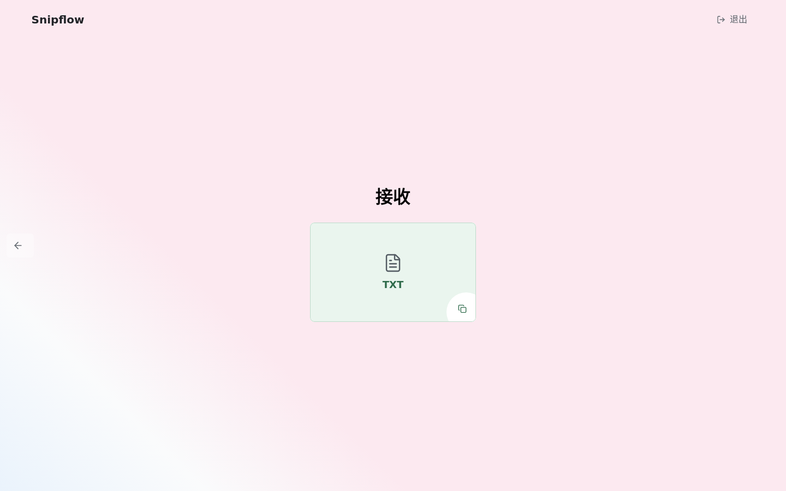
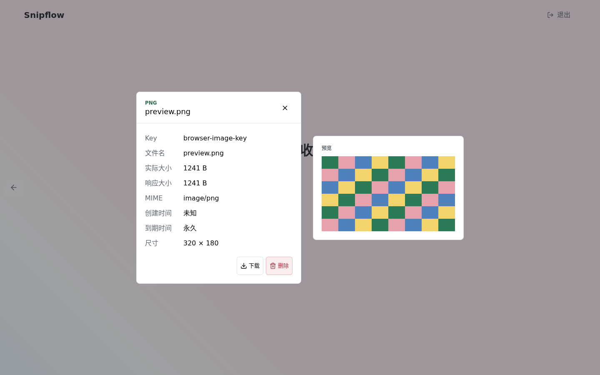
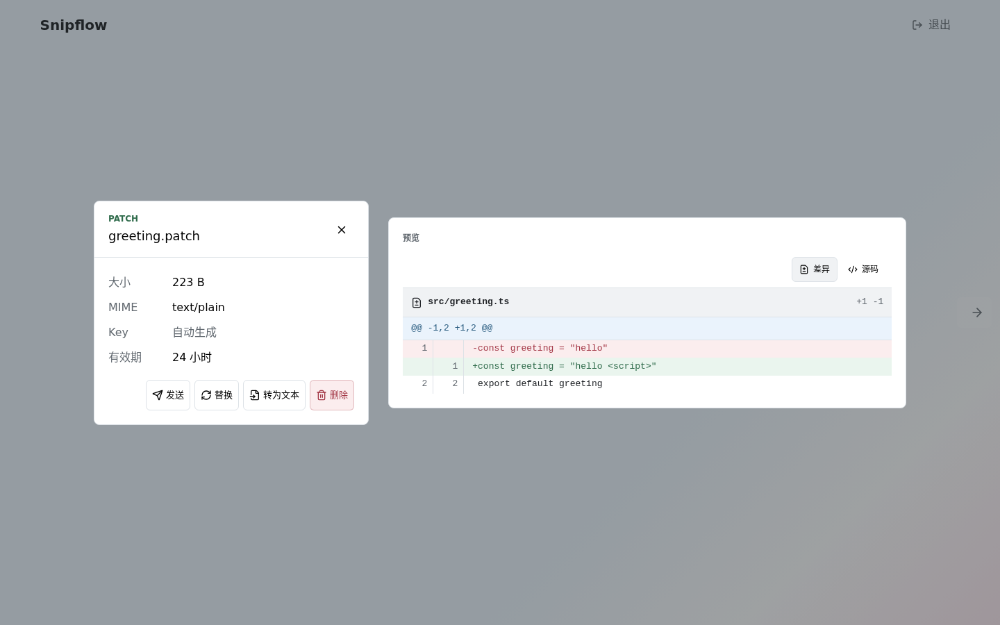
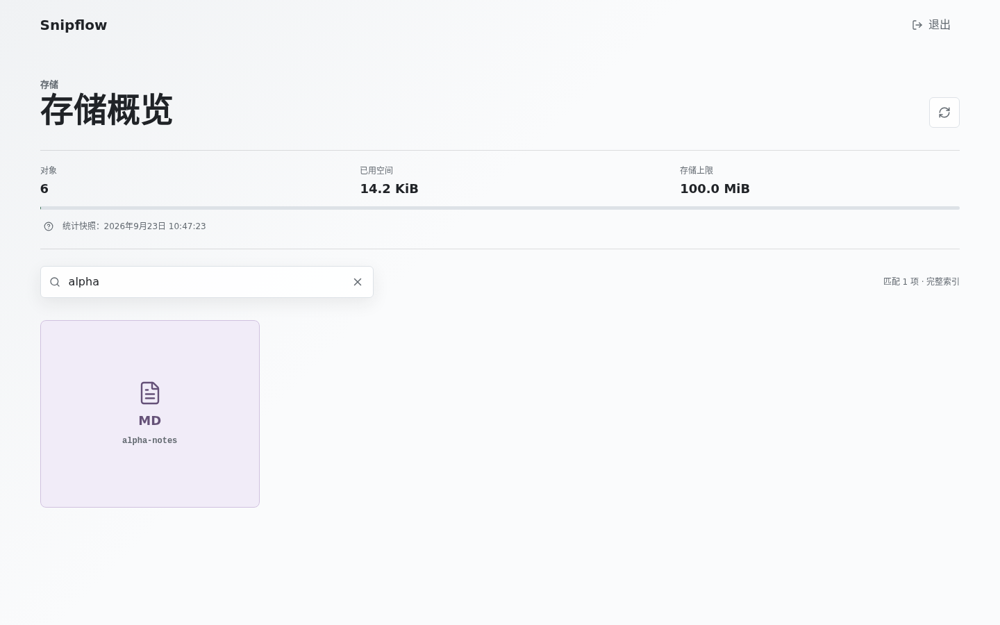

# Snipflow Page

> 用一个短 Key，在设备之间传递文本、文件和可读的差异内容。

[](https://github.com/snipflow/page/actions/workflows/ci.yml)
[](https://react.dev/)
[](https://vite.dev/)

Snipflow Page 是 Snipflow 的浏览器客户端：输入或拖入内容，交给 Worker 保存，再把 Key 或接收链接发给另一台设备。它是一个可以部署到任意静态托管的 React SPA，不把访问 Token 写进源码、环境变量、URL 或构建产物。

## 页面展示

这些截图由 Playwright 在 `1440 × 900` 桌面视口中生成，展示了当前提交中的真实页面。

<table>
  <tr>
    <td width="33%"></td>
    <td width="33%"></td>
    <td width="33%"></td>
  </tr>
  <tr>
    <td align="center">Key 直达接收</td>
    <td align="center">图片预览与元数据</td>
    <td align="center">统一 diff 阅读</td>
  </tr>
</table>

<p align="center">
  
</p>
<p align="center">仪表盘瀑布流、容量快照与本地 Key 搜索</p>

## 产品特性

### 发送与接收

- 输入、粘贴、拖放或选择文本与任意文件。
- 原始字节直传；未知格式也能原样发送、接收和下载。
- 使用随机或自定义 Key；设置 1 小时、24 小时、7 天、永久或自定义有效期。
- 发送前重编文本、替换文件、修改文件名或修正未知 MIME。
- Key 冲突时改名或确认覆盖，不会静默覆盖。
- 发送后复制 Key 或接收链接；链接只带 Key，打开后自动读取。
- 接收页复制文本、下载原文件或删除内容。
- 切换发送与接收时保留当前草稿。

### 本地转换

- 自动识别 JSON、SVG、XML，以及 Base64、Data URL、十六进制中的文件特征。
- 文本按 UTF-8、Base64、Base64 Data URL 或十六进制转换为附件。
- 转换时设置文件名、类型和 MIME，也可使用自定义格式。
- 一键复制 Bash 或 PowerShell 命令，将本地文件生成 Base64 Data URL。
- 文本附件按 UTF-8 转回文本；二进制转为可还原的标准 Base64。
- 转换生成的附件可恢复转换前原文。
- 识别、转换和预览均在本地完成，点击发送后才上传。

### 内容预览

- Markdown/GFM 渲染与源码切换。
- TXT、XML、YAML、JSON、HTML、CSS、JS、TS、SVG 源码预览；CSV/TSV 表格预览并可切换源码。
- Python、Go、Rust、Java、C/C++、C#、PHP、Ruby、Swift、Kotlin、Scala、Dart、Lua、R、Shell、PowerShell、BAT、SQL 按语言语法高亮预览。
- JSX/TSX、Vue、Svelte、SCSS/Sass/Less、TOML、INI、GraphQL、Protobuf 文件识别、源码高亮预览与 UTF-8 文本互转。
- PNG、JPEG、WebP、GIF 图片预览。
- MP3、WAV、OGG、Opus、FLAC、AAC、M4A 音频播放。
- MP4、WebM、MOV、M4V、OGV、AVI、MKV 视频播放；实际解码能力取决于浏览器。
- PATCH/DIFF 按文件、区块和行号展示增删，也可切换源码。
- PDF、DOCX、XLSX、PPTX、ZIP、GZIP、7Z、RAR 和未知文件展示元数据并保留下载。
- 文件名、MIME 与字节特征冲突时降级预览，不执行 HTML、SVG、脚本或未知内容。

### 存储管理

- 仪表盘查看全部 Snip、对象数量、已用空间和存储上限。
- 分页建立本地快照，瀑布流逐屏展示，不批量下载正文。
- 在已加载快照中区分大小写搜索 Key，不发起搜索请求。
- 打开详情时才读取正文，并缓存已读内容。
- 查看 Key、文件名、MIME、大小、创建时间、到期时间和剩余有效期。
- 在详情中复制 Key/正文、预览、下载或删除。
- 手动刷新索引与统计；失败时保留上次可用快照。

### 会话与安全

- Token 只在运行时输入，不进入 URL、源码或构建产物。
- 会话支持闲置过期和跨标签页同步；登录后返回原目标页面。
- Markdown 禁止原始 HTML、不安全链接和自动远程图片；图片、Markdown 与 diff 均受预览预算限制。
- 网络中断时保留草稿；结果未知的写操作不会自动重试。

## Fork 到上线

### 1. Fork 并准备本地环境

在 GitHub 上点击 **Fork**，然后将你的副本克隆到本地：

```bash
git clone https://github.com/<your-account>/page.git
cd page

corepack enable
corepack prepare pnpm@12 --activate
pnpm install
```

需要 Node.js 24 LTS 和 pnpm 12。没有 Corepack 时，也可以执行 `npm install --global pnpm@12`。

### 2. 连接 Snipflow Worker

Page 只负责浏览器体验，存储和鉴权由 Snipflow Worker 提供。先准备一个可访问的 Worker URL，再创建本地环境文件：

```bash
cp .env.example .env.local
```

编辑 `.env.local`：

```dotenv
VITE_SNIPFLOW_API_ORIGIN=https://worker.example.com
VITE_MAX_OBJECT_BYTES=10485760
VITE_AUTH_IDLE_TTL_SECONDS=1800
```

`VITE_SNIPFLOW_API_ORIGIN` 是公开的 API 地址，不要填 Token。Worker 与 Page 不同源时，在 Worker 配置中将 Page 的完整 Origin 加入 `SNIPFLOW_CORS_ORIGINS`，例如 `https://page.example.com`；不要使用 `*`。

### 3. 本地运行

```bash
pnpm dev
```

打开 <http://127.0.0.1:10010>。输入 Worker Token 后即可发送文本或文件，再用生成的 Key 在另一页接收。

### 4. 部署静态站点

所有平台都遵循同一组设置：

| 设置 | 值 |
| --- | --- |
| Install command | `pnpm install --frozen-lockfile` |
| Build command | `pnpm build` |
| Output directory | `dist` |
| Node.js | `24` |
| 必需环境变量 | `VITE_SNIPFLOW_API_ORIGIN` |
| 可选环境变量 | `VITE_MAX_OBJECT_BYTES`、`VITE_AUTH_IDLE_TTL_SECONDS` |

推荐使用 Vercel、Netlify 或 Cloudflare Pages。将 GitHub Fork 作为项目来源，填入上表设置和环境变量，推送到 `master` 后平台就会自动构建。部署后确认以下两点：

1. 静态主机把未知路径回退到 `/index.html`，否则刷新 `/receive/<key>` 或 `/dashboard` 会返回 404。
2. Worker 的 `SNIPFLOW_CORS_ORIGINS` 使用部署后的精确 Origin（协议、域名和端口），不要带路径或通配符。

用 Nginx 或其他静态服务器时，先构建并将 `dist/` 作为站点根目录：

```bash
pnpm build
pnpm preview --host 127.0.0.1
```

`pnpm preview` 只用于本地验收，生产环境请使用你的静态托管服务，并配置 SPA fallback。

## 路由与工作流

| 路由 | 用途 |
| --- | --- |
| `/` | 根据会话跳转到认证页或发送页 |
| `/auth` | 输入并验证运行时 Token |
| `/send` | 粘贴文本、选择文件、填写 Key/有效期并发送 |
| `/receive` | 输入 Key 接收内容 |
| `/receive/:key` | 通过分享链接直接接收 |
| `/dashboard` | 搜索和管理已保存对象 |

开发服务器会把 `/health`、`/snip` 和 `/stats` 代理到 `VITE_SNIPFLOW_API_ORIGIN`。生产构建则直接请求这个公开地址；Token 始终在浏览器运行时输入。

## 配置参考

| 变量 | 必需 | 默认值 | 作用 |
| --- | --- | --- | --- |
| `VITE_SNIPFLOW_API_ORIGIN` | 开发/生产均必需 | 无 | Worker API 的 Origin |
| `VITE_MAX_OBJECT_BYTES` | 否 | `10485760` | 前端单对象大小上限（10 MiB） |
| `VITE_AUTH_IDLE_TTL_SECONDS` | 否 | `1800` | Token 闲置过期时间；设为 `0` 表示不按闲置时间过期 |

这些变量会在启动或构建时校验。`.env.local` 已被 Git 忽略，请不要提交真实 Token 或私有地址。

## 开发与验证

```bash
pnpm format:check  # Prettier
pnpm typecheck     # TypeScript
pnpm lint          # Oxlint
pnpm test          # Vitest
pnpm test:e2e      # Playwright：1440x900 + 390x844
pnpm build         # 生产构建
```

E2E 默认启动 `http://127.0.0.1:10010`，并在桌面与移动视口中验证认证、发送、接收、预览、下载、删除、路由和响应式布局。失败时查看 `pnpm test:e2e:report`；调试交互可用 `pnpm test:e2e:debug`。测试截图与报告写入被 Git 忽略的 `test-results/` 和 `playwright-report/`。

## 技术栈

React 19、TypeScript、Vite、TanStack Router/Query、Zustand、Base UI、Tailwind CSS、Lucide、Motion、Zod、Vitest、Testing Library、MSW 和 Playwright。

更多模块边界、对象模型与预览策略见 [`architecture.md`](./architecture.md)。
